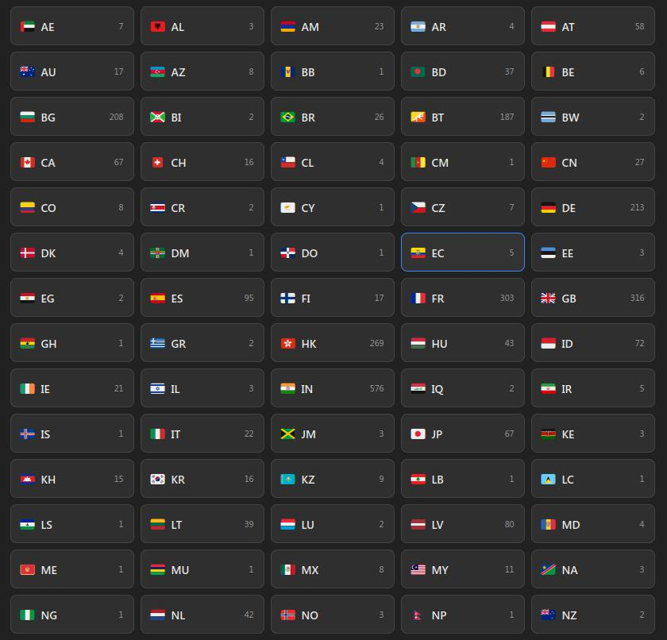
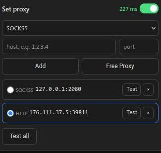

# set-proxy

Browser proxy switcher extensions. Two builds are included:

- `set-proxy-firefox.zip` — Firefox MV2
- `set-proxy-chrome.zip` — Chrome MV3

Both support SOCKS5 / HTTP / HTTPS proxies and free-proxy scanning. The Firefox build also includes `gen_icons.py` for regenerating toolbar icons.

<div align="center">
  
  
</div>

## Install

### Firefox
1. Open `about:addons`
2. Click the gear icon → **Install Add-on From File**
3. Select `set-proxy-firefox.zip`
4. Pin the extension for quick access

### Chrome
1. Open `chrome://extensions`
2. Enable **Developer mode** (top right)
3. Click **Load unpacked**
4. Select the folder extracted from `set-proxy-chrome.zip`

## Usage

1. Click the extension icon to open the popup
2. Add a proxy: choose type, enter host and port, click **Add**
3. Select a proxy from the list
4. Toggle the extension **ON** to route traffic through it

## Free proxy scanner

Open the free proxy page from the popup. Click **Test all** to scan the list. Working proxies are shown with their ping in milliseconds.

## Files

### Firefox (`set-proxy-firefox.zip`)
```
background.js
popup.html
popup.js
freeproxy.html
freeproxy.js
manifest.json
icons/
gen_icons.py
```

### Chrome (`set-proxy-chrome.zip`)
```
background.js
popup.html
popup.js
freeproxy.html
freeproxy.js
manifest.json
icons/
```

## Notes

- These zips are the exact upload-ready packages. No build step is required.
- If you need to modify the source, unzip the matching archive, edit the files, and rezip.
