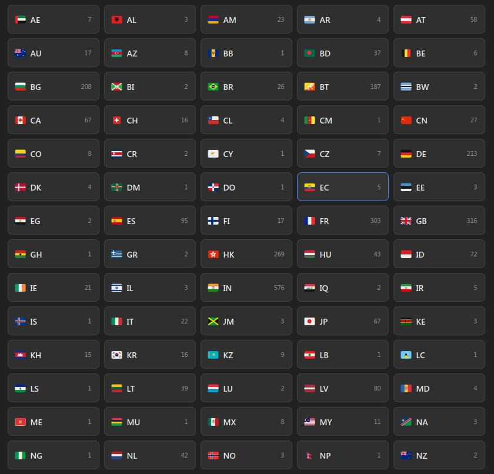
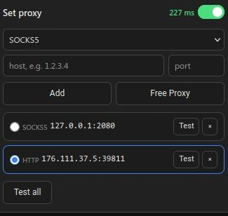

# set-proxy

Browser proxy switcher. Manage a list of SOCKS5 / HTTP / HTTPS proxies, pick
one, and toggle routing through it.

<div align="center">
  
  
</div>

## Layout

| Path              | What it is                                            |
| ----------------- | ----------------------------------------------------- |
| `firefox/`        | Firefox MV2 extension — **load this**                |
| `chrome/`         | Chrome MV3 extension — **load this**                 |
| `set-proxy-*.zip` | Packaged copies, generated from the folders above    |

There is no build step. To install from source, point the browser at the folder
directly. To produce the zips:

```sh
cd firefox && zip -r ../set-proxy-firefox.zip . -x '.*'
cd ../chrome && zip -r ../set-proxy-chrome.zip . -x '.*'
```

## Install from source

**Firefox** — `about:debugging` → This Firefox → Load Temporary Add-on →
pick `firefox/manifest.json`.

**Chrome** — `chrome://extensions` → enable Developer mode → Load unpacked →
pick the `chrome/` folder.

## Usage

1. Click the extension icon to open the popup
2. Add a proxy: choose a type, enter host and port, click **Add**
3. Select a proxy from the list
4. Toggle the extension **ON** to route traffic through it

Ping results are cached per proxy, so opening the popup does not re-probe
anything. Use **Test** / **Test all** to refresh them on demand.

## Free proxy scanner

Open the free proxy page from the popup. Pick a country (or paste your own
`ip:port` / `proto://ip:port` list), and the extension probes each candidate,
adding the ones that respond. Scans can be stopped at any time.

Proxy lists come from public community sources (proxifly, iplocate). They are
unvetted — a proxy you add can see everything routed through it.

### Chrome caveat

Chrome has no per-request proxy API, so each probe temporarily makes its proxy
the browser's global proxy. A scan therefore interrupts your browsing until it
finishes or you stop it. The Firefox build routes probes per-request and has no
such effect.